# Instalación del programa
1. Ingresar a la página web de QGIS: http://www.qgis.org/ y descargar la última versión de QGIS. Para la presente práctica usaremos la versión 2.18 Las Palmas.

- Opción “Descargar Ahora”
- Pestaña “Descargas de instalación”
- Escoger de acuerdo a su sistema operativo (windows, MacOS, Ubuntu/debian)
- Sección “Último lanzamiento”
- Escoger de acuerdo a la configuración de su computadora la versión de 32 o 64 bit
- Ejecutar el programa descargado

Para mas detalles sobre la instalacion [ir a la guia de instalacion](https://gcarrascoe.github.io/class/qgis_instalacion.html)

# Descripción General del programa
2. QGIS cuenta con 4 secciones importantes que hay que identificar antes de empezar el trabajo:
- Menú y controles
- Ventana de visualización de datos
- Tabla y contenidos
- Importación de datos

# Ejercicio 1
## Datos Vectoriales: Importación
3. En la sección Importación de datos, hacer click en __*Agregar capa vectorial*__ 

4. Agregar al área de trabajo todos los archivos .shp de la carpeta __*CAPAS*__.
5. Hacer click derecho sobre la capa importada y seleccionar __*Zoom a la capa*__ para visualizarla en la ventana de visualización de datos.
6. Seleccionar y arrastar las capas dentro de la Tabla de contenidos para ordenarlas.
7. En el panel de capas, dar click en el símbolo __*Anadir grupo*__ 

, crear los grupos *'poligonos'*, *'lineas'* y *'puntos'*.
8. Arrastrar las capas a los grupos *'poligonos'*, *'lineas'* y *'puntos'* de acuerdo al tipo de geometria.

9. Para guardar el proyecto, hacer click en Guardar dentro de la sección de Menú y controles, y seleccionar la dirección donde se guardará el proyecto.

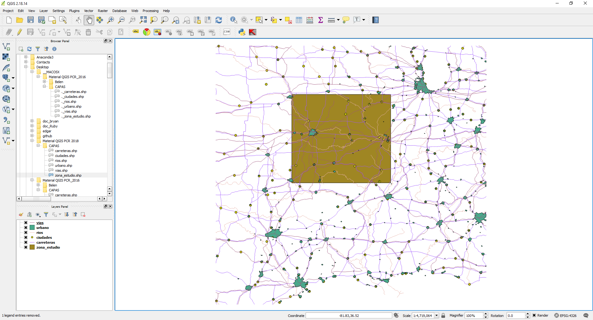

## Datos Vectoriales: Manejo de atributos
10. Seleccionar la capa __*ríos*__ dentro de la Tabla de contenidos.
11. Hacer click en __*Abrir tabla de atributos*__ 

 en el Menú y controles.
12. Observar los datos que contiene la capa.
13. Dentro de Menú y controles, hacer click en __*Seleccionar atributo por área*__ 

14. Seleccionar algún elemento de la capa __*ríos*__. Se sombreará de amarillo el elemento si la selección ha sido correcta.
15. Hacer click en __*Abrir tabla de atributos*__.
16. Hacer click en __*Mover la selección Arriba*__ 

, dentro de Tabla de atributos.

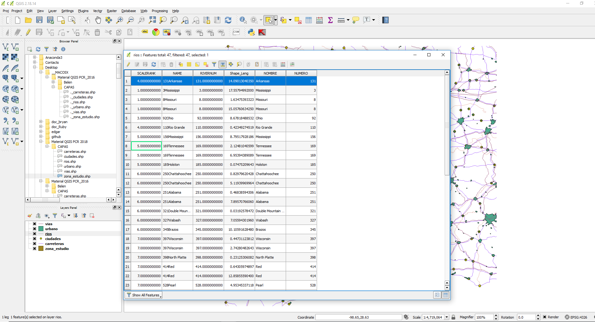

## Datos Vectoriales: Simbología de capas
17. Seleccionar la capa __*ciudades*__ dentro de la Tabla de contenidos.
18. Hacer click derecho y seleccionar __*propiedades*__.
19. Ir a la sección __*Estilo*__.
20. Seleccionar la opción __*Single Symbol*__.
21. Cambiar el color, grosor y apariencia de los puntos.
22. Ver en la ventana de visualización de datos los cambios realizados.
23. Repetir pasos del 17 al 19.
24. En la sección __*Estilo*__ Seleccionar la opción __*Categorized*__.
25. En __*Column*__ seleccionar el atributo __*ADM1NAME*__.
26. Hacer click en __*Classify*__.
27. Ver en la ventana de visualización de datos los cambios realizados.
28. Repetir pasos del 17 al 19.
29. Seleccionar la opción __*Graduated*__.
30. En __*Column*__ seleccionar el atributo __*ELEVATION*__.
31. Hacer click en __*Classify*__.
32. Ver en la ventana de visualización de datos los cambios realizados.

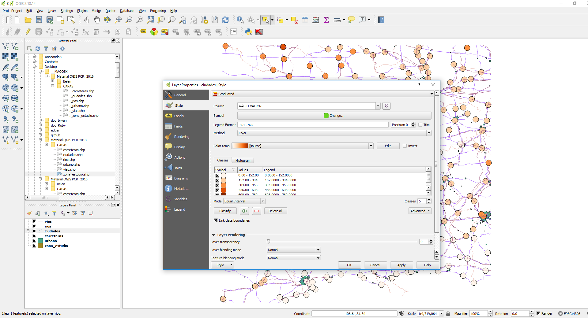

## Datos vectoriales: Geoprocesos básicos
33. Ir a la __*barra de herramientas –> vectorial –> herramientas de geoproceso -> Cortar*__.
34. Establecer __*capa vectorial de entrada -> ciudades*__.
35. Establecer __*capa de corte -> zona_estudio*__.
36. Establecer __*ruta de archivo shape de salida. Aceptar. Cerrar.*__ (poner nombre de archivo: ‘ciudades_clip.shp’).
37. En la Tabla de contenidos, hacer click derecho a la __*capa ciudades – Estilos – Copiar estilo*__.
38. En la Tabla de contenidos, hacer click derecho a la __*capa ciudades_clip – Estilos – Pegar estilo*__.
39. Ir a la __*barra de herramientas – vectorial – herramientas de geoproceso -> Buffer de distancia fija*__.
40. Establecer __*capa vectorial de entrada -> rios, seleccionar Distancia -> 0.05, seleccionar disolver*__, establecer archivo shape de salida (‘rios_buffer’).
41. Ir a la __*barra de herramientas – vectorial – herramientas de geoproceso -> Interseccion*__.
42. Establecer __*capa de entrada -> ciudades_clip, capa de interseccion -> rios_buffer*__, establecer archivo shape de salida (‘ciudades_interseccion’).

## Instalación de Complementos (Plugins)
43. Ir a la __*barra de herramientas –> Complementos*__.
44. En el campo __*buscar*__ escribir __*OpenLayers*__, seleccionar __*OpenLayers Plugin*__ y hacer click en __*instalar complemento*__.
45. Ir a la __*barra de herramientas – Web- OpenLayers Plugin –OpenStreetMap –> OpenStreetMap*__. (se debe tener conexión a internet).

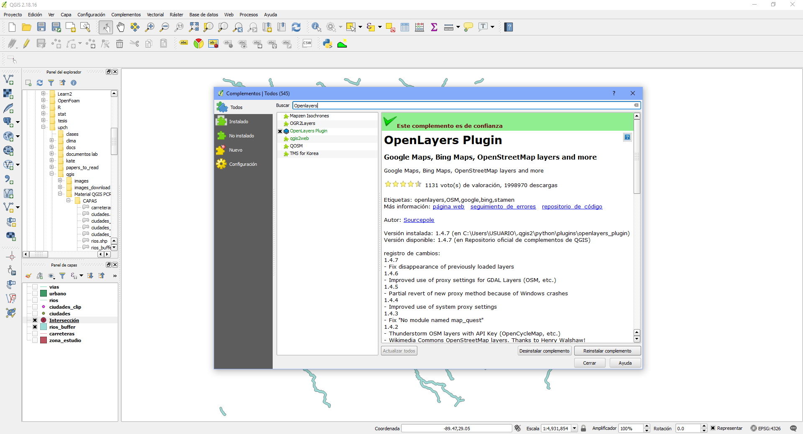

## Datos Vectoriales: Exportación
46. Seleccionar la capa __*ciudades_interseccion*__ dentro de la Tabla de contenidos.
47. Hacer click derecho y seleccionar __*Guardar como*__.
48. Seleccionar Formato __*Comma Separated Value [CSV]*__.
49. Seleccionar __*Coordinate Reference System (CRS)*__ correcto. En este caso (EPSG:4326, WGS 84).
50. Seleccionar la dirección donde se va a guardar el archivo.
51. Hacer click en __*Ok*__.

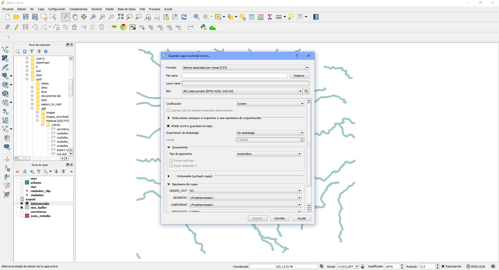

# Ejercicio 2
## Importar datos vectoriales
1. Importar el shapefile __*loreto_dist*__, ubicado en la carpeta __*Loreto*__.
2. Arrastrar el archivo __*cases*__ del explorador de archivos al panel de capas.

## Union de atributos
3. Dar click derecho a la capa __*loreto_dist*__, ir a la pestaña __*uniones*__. 
4. Dar click al símbolo __*Anadir union vectorial*__, seleccionar capa de unión __*cases*__, campo de unión __*district*__ y, campo objetivo __*NOMBDIST*__.

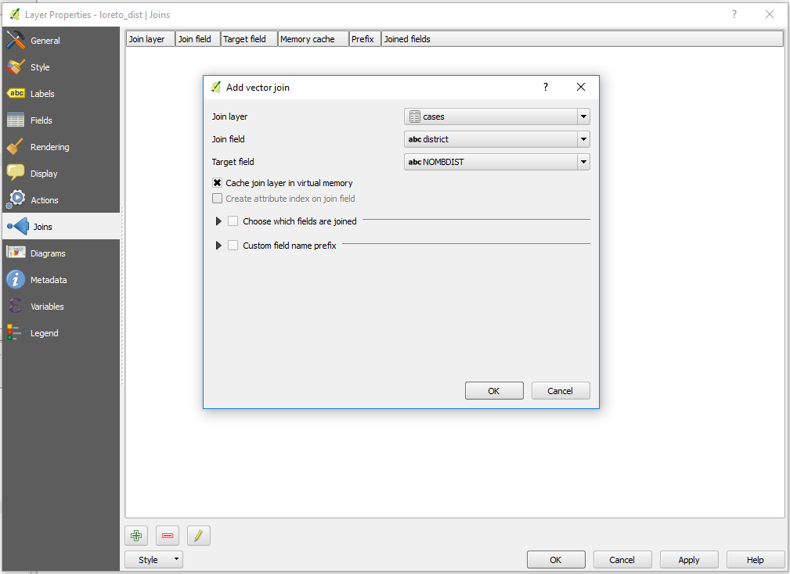

## Cambio de Simbología
5. Ir a la __*tabla de atributos*__ de la capa __*loreto_dist*__, hacer click en el símbolo 

 (cntrl + E).
6. Hacer click en el símbolo 

 __*Añadir campo*__ (cntrl + W), crear nuevo campo de tipo numerico de nombre __*cases*__ y establecer el valor al mismo del campo __*cases_vivax*__.
7. En el símbolo 

 seleccionar __*cases*__, en campo de escritura ubicado a la derecha, escribir __*cases_vivax*__, hacer click en __*Actualizar todo*__, ubicado a la derecha del campo de escritura.

8. Hacer click en 

 (cntrl + G), hacer click en 

 (cntrl + E). Cerrar la ventana.

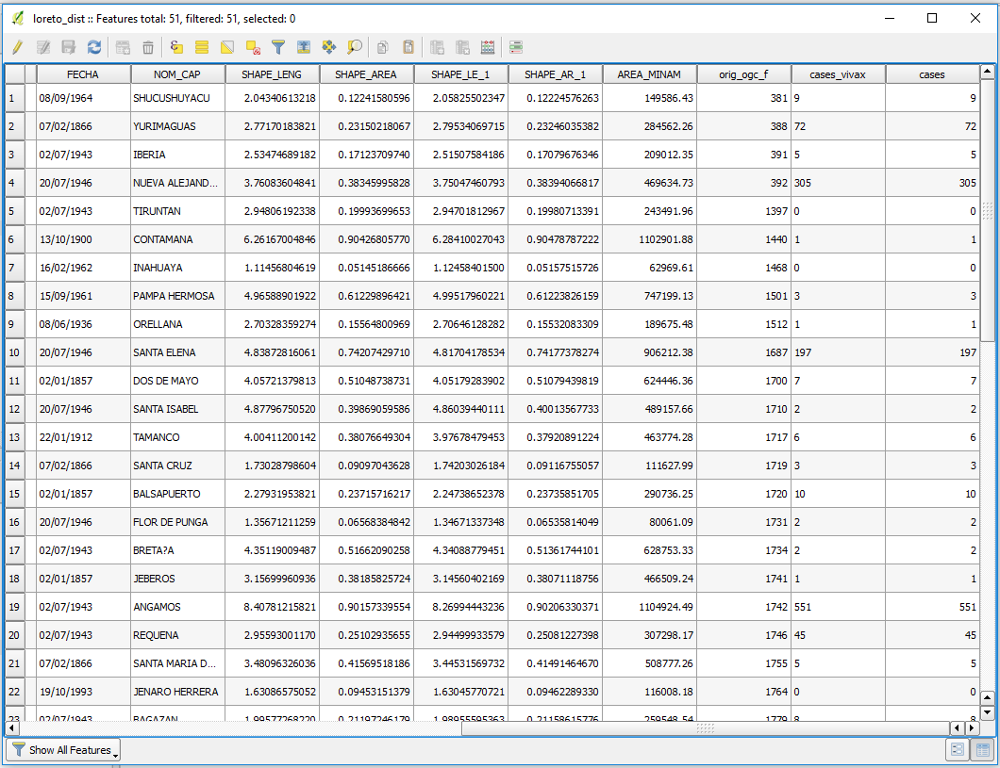

9. Abrir las propiedades de la capa __*loreto_dist -> estilos*__, seleccionar estilo __*graduado*__, elegir columna __*cases*__, elegir la rampa de color, dar click en __*clasificar*__, aceptar.

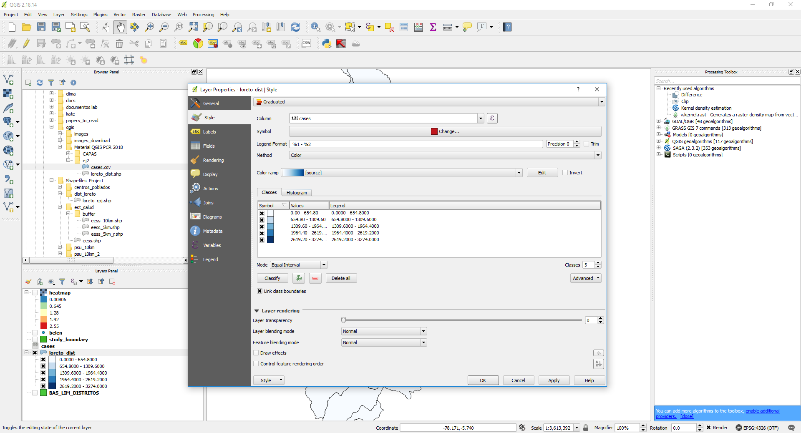

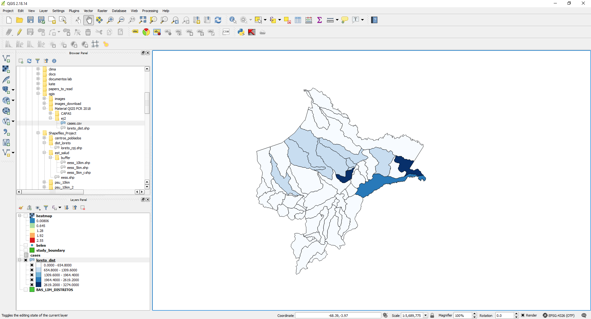

# Ejercicio 3
## Importar datos vectoriales
1. Agregar los archivos __*study_boundary*__ y __*study_area*__, ubicados en la carpeta __*Belen*__, al panel de capas.
2. En la sección de importación de datos hacer click en __*Agregar capa de texto delimitado*__.
3. Seleccionar el archivo __*Belen.csv*__, __*campo X = x, campo Y = y*__. Aceptar.

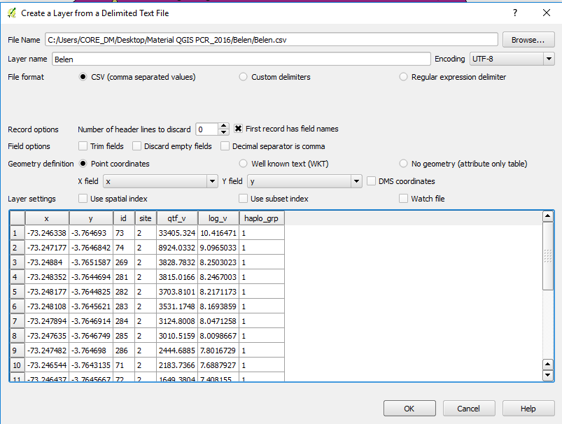

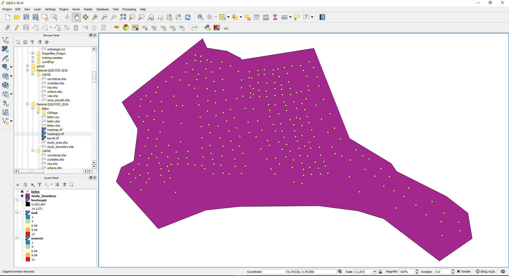

## Importación mapa base
4. Agregar el archivo __*yru65056046-160209-2217.map*__.

## Simbología & etiquetas
5. Abrir las propiedades de la capa __*study_area*__, darle estilo categorizado.
6. En la pestaña __*Etiquetas*__, seleccionar __*mostrar etiquetas para esta capa*__, etiquetar con = __*site*__.
7. En la sub-pestaña __*ubicacion*__, seleccionar __*usar perimetro (curva)*__ y, posición dependiente de la orientación de líneas.

8. Revisar analisis estadistico* 

## Heatmap - Kernel density
9. Buscar el complemento *Heatmap* y asegurarse que este activado.

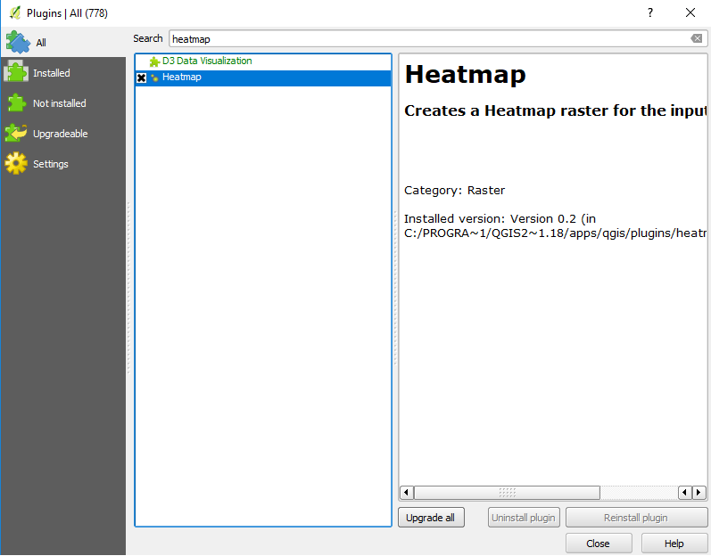

10. Ir a la __*barra de herramientas -> raster -> Heatmap*__. 
11. Establecer capa de puntos de entrada a __*Belen*__, nombrar al raster de salida __*heatmap_qtf*__, radio 30,en __*Avanzado*__, establecer como campo de peso a __*qtf_v*__. Aceptar.

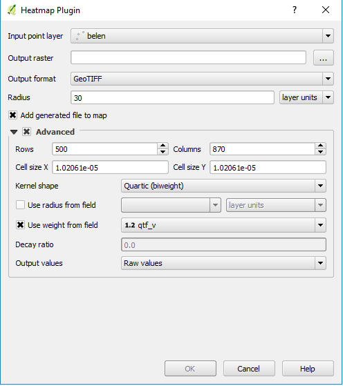

12. Repetir el paso 11, cambiando el campo de peso a __*log_v*__, nombrar al raster de salida __*heatmap_log*__.
13. Dar simbología a las capas.

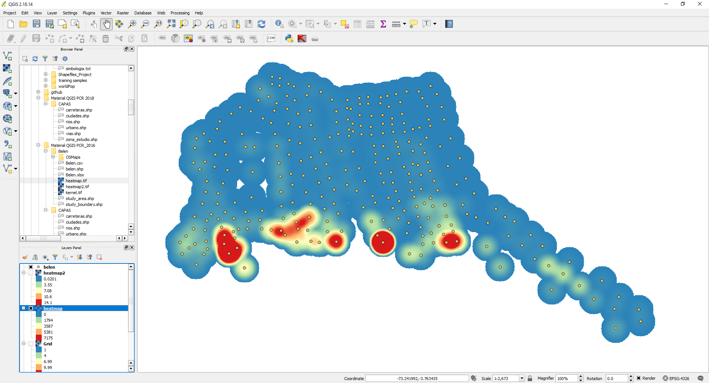

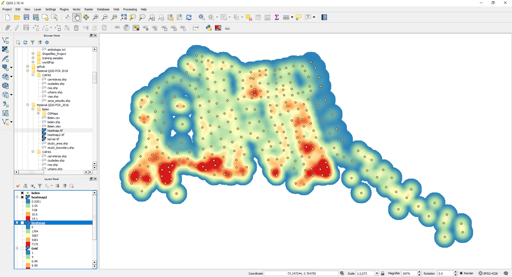

## Nearest Neighbour interpolation
14. Ir a la barra de __*herramientas -> procesamiento -> caja de herramientas*__.
15. En el buscador, escribir *'nearest'*, dar doble click a __*Nearest neighbour*__ del grupo __*SAGA*__. 

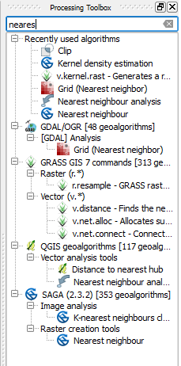

16. En puntos establecer a la capa Belen, Atributo = __*haplo_grp*__, extension = __*study_boundary*__, tamaño de la celda = 0.000001, nombrar al raster de salida __*nn_haplo*__. 

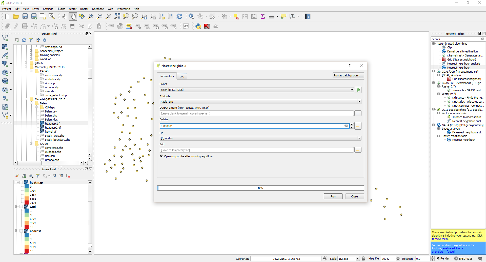

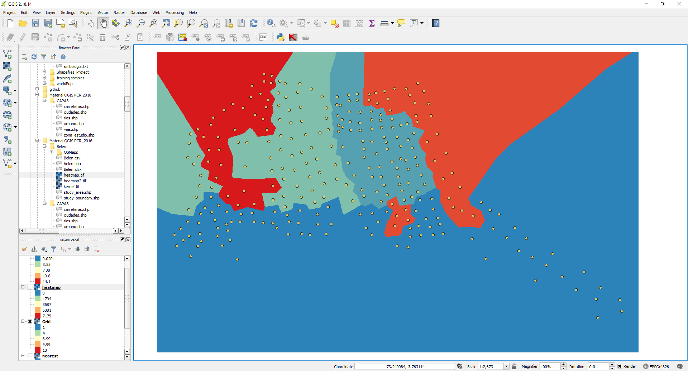

17. Ir a la __*barra de herramientas -> raster -> extraccion -> clipper**__.
18. Archivo de entrada = __*nn_haplo*__, archivo de salida = __*nn_haplo_bound*__, metodo de cortado = __*capa mascara*__, capa mascara = __*study_boundary*__. Aceptar.
19. Cambiar la simbología.

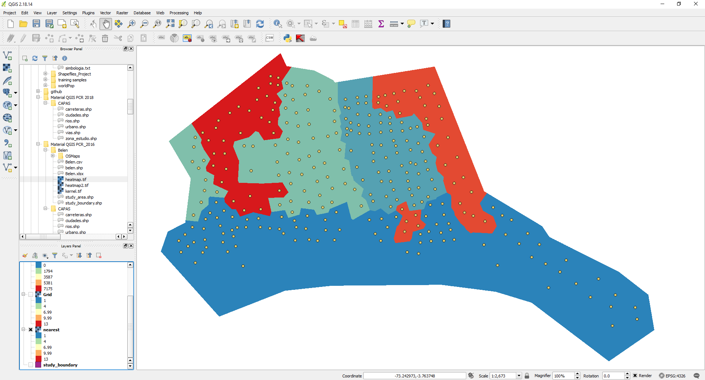

# Ejercicio 4
## Nueva composición de impresión
1. Con los resultados obtenidos en el ejercicio 3, ir a la __*barra de herramientas -> Proyecto -> Nueva composición de impresión*__.

2. Poner de título *myfirstcomposer*.

## Definir escala y agregar grilla
3. Dar click en el ícono __*Agregar nuevo mapa*__ 

 y dibujar en rectángulo en el lienzo, el cual contendrá el mapa realizado en QGIS.
4. Dar click en el ícono __*Mover contenido del objeto*__ 

, y centrar la imagen del mapa.
5. Con el mapa seleccionado, ir a la pestaña de __*propiedades del objeto*__, en __*propiedades principales*__ establecer escala 5000. Volver a centrar la imagen con la herramienta __*Mover contenido del objeto*__ de ser necesario.
6. En la pestaña de __*propiedades del objeto*__, ir a __*grilla*__, dar click en el símbolo __*Agregar*__*+*, seleccionar __*dibujar grilla 1*__, __*unidad de intervalo*__ = unidades del mapa, __*intervalo*__ x= 0.001, y= 0.002, seleccionar __*mostrar coordenadas*__.

## Agregar leyenda
7. Dar click en el ícono __*Agregar leyenda*__, dibujar un rectángulo en el cual se encontrará la leyenda.

8. Con la leyenda seleccionada ir a la pestaña de propiedades del objeto, quitar la selección a la opción de actualizar automaticamente y eliminar las entradas que no se necesitan con el símbolo __*remover*__ *-* (dejar solo el resultado de *heatmap* y *nearest neighbour*).
9. Seleccionar el item que contiene el **heatmap** y dar click en el símbolo de __*edición*__, cambiarle el nombre a **Parasimetia of P. vivax**, hacer lo mismo para el **nearest neighbour** y ponerle de nombre **Haplogroups distribution**.

10. En la opción de __*columnas*__, cambiar a 2, seleccionar enmarcado (Frame).

## Agregar escala gráfica
11. Hacer click en el símbolo __*Agregar escala*__ 

 , y dibujar un rectángulo. 
12. Hacer click en el símbolo __*Agregar imagen*__ 

 , y dibujar un rectangulo. En las propiedades del objeto expandir __*buscar directorios*__ y elegir una imagen que represente la dirección norte.

## Agregar texto
13. Hacer click en el símbolo __*Agregar texto*__ 

, dibujar un rectangulo. En las propiedades del objeto, cambiar el texto y poner **My first map**.

## Agregar forma
14. Hacer click en el símbolo __*Agregar forma -> Rectangulo*__ 

, dibujar un rectángulo que enmarque a la hoja de trabajo. 
15. En propiedades del objeto cambiar el estilo y darle un relleno vacío. De esta manera nuestro mapa tendrá un marco.

## Exportación
16. Dar click en el símbolo 

. y guardar el archivo en la dirección de su proyecto.
