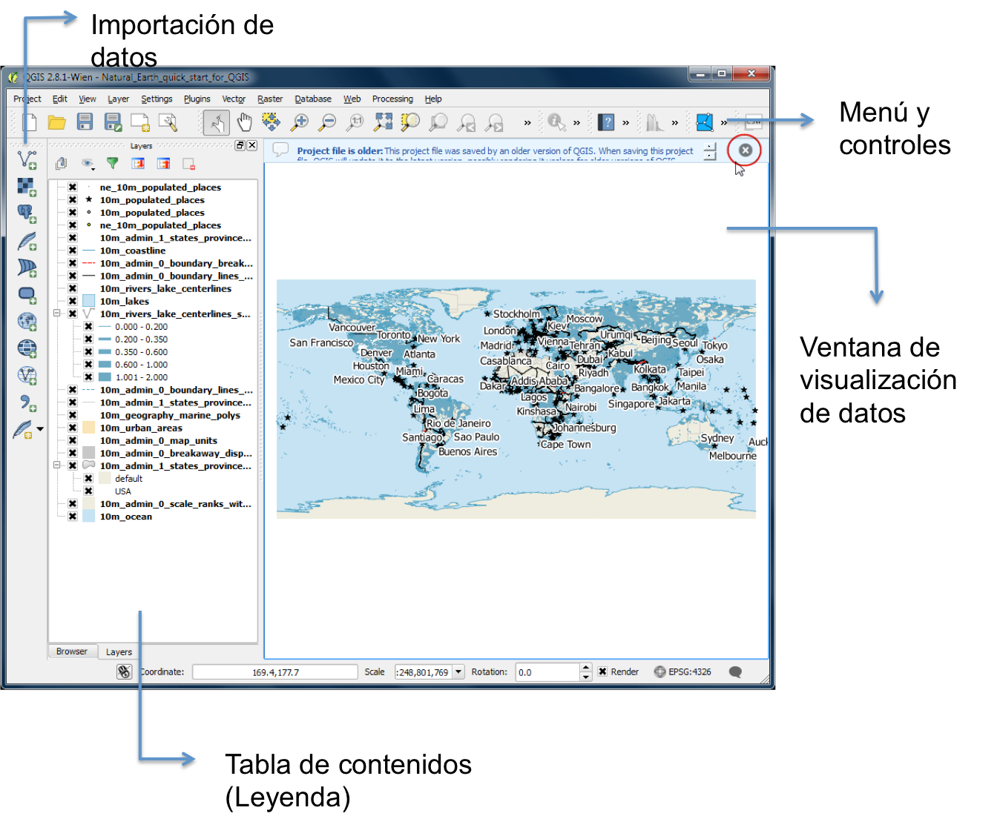

# Descripción de Procedimientos
## Instalación del programa

1. Ingresar a la página web de QGIS: http://www.qgis.org/ y descargar la última versión de QGIS. Para la presente práctica usaremos la versión 2.18 Las Palmas. 
- Opción “Descargar Ahora”
- Pestaña “Descargas de instalación”
- Escoger de acuerdo a su sistema operativo (windows, MacOS, Ubuntu/debian)
- Sección “Último lanzamiento”
- Escoger de acuerdo a la configuración de su computadora la versión de 32 o 64 bit
- Ejecutar el programa descargado

Para mas detalles sobre la instalacion [ir a la guia de instalacion](https://EdgarJoao30.github.io/qgis_class/instalacion.html)

## Descripción General del programa
2. QGIS cuenta con 4 secciones importantes que hay que identificar antes de empezar el trabajo:
- Menú y controles
- Ventana de visualización de datos
- Tabla y contenidos
- Importación de datos

## Datos Vectoriales: Importación
3. En la sección Importación de datos, hacer click en Agregar capa vectorial 

4. Agregar al área de trabajo todos los archivos .shp de la carpeta “CAPAS”.
5. Hacer click izquierdo sobre la capa importada y seleccionar Zoom to layer para visualizarla en la ventana de visualización de datos.
6. Seleccionar y arrastar las capas dentro de la Tabla de contenidos para ordenarlas.
7. Para guardar el proyecto, hacer click en Guardar dentro de la sección de Menú y controles, y seleccionar la dirección donde se guardará el proyecto.

## Datos Vectoriales: Manejo de atributos
8. Seleccionar la capa ríos dentro de la Tabla de contenidos.
9. Hacer click en Abrir tabla de atributos 

 en el Menú y controles.
10. Observar los datos que contiene la capa.
11. Dentro de Menú y controles, hacer click en Seleccionar atributo por área 

12. Seleccionar algún elemento de la capa ríos. Se sombreará de amarillo el elemento si la selección ha sido correcta.
13. Hacer click en Abrir tabla de atributos.
14. Hacer click en Mover la selección Arriba 

, dentro de Tabla de atributos.

## Datos Vectoriales: Simbología de capas
15. Seleccionar la capa ciudades dentro de la Tabla de contenidos
16. Hacer click izquierdo y seleccionar propiedades.
17. Ir a la sección Estilo.
18. Seleccionar la opción Single Symbol.
19. Cambiar el color, grosor y apariencia de la línea.
20. Ver en la ventana de visualización de datos los cambios realizados.
21. Repetir pasos del 17 al 19.
22. Seleccionar la opción Categorized.
23. En Column seleccionar el atributo ADM1NAME.
24. Hacer click en Classify.
25. Ver en la ventana de visualización de datos los cambios realizados.
26. Repetir pasos del 17 al 19.
27. Seleccionar la opción Graduated.
28. En Column seleccionar el atributo ELEVATION.
29. Hacer click en Classify.
30. Ver en la ventana de visualización de datos los cambios realizados.

## Datos vectoriales: Geoprocesos básicos
31. Ir a la barra de herramientas – vectorial – herramientas de geoproceso -> Cortar.
32. Establecer capa vectorial de entrada -> ciudades.
33. Establecer capa de corte -> zona_estudio.
34. Establecer ruta de archivo shape de salida. Aceptar. Cerrar. (poner nombre de archivo: ‘ciudades_clip.shp’).
35. En el Panel de capas, dar click derecho a la capa ciudades – Estilos – Copiar estilo.
36. En el Panel de capas, dar click derecho a la capa ciudades_clip – Estilos – Pegar estilo.
37. Abrir tabla de atributos de la capa ciudades_clip, Hacer click en el símbolo 

 (cntrl + E).
38. Hacer click en el símbolo 

 Anadir campo (cntrl + W), establecer nombre ‘size_cor’, tipo ‘Numero decimal’, longitud 10, precisión 9 – Aceptar.
39. En el símbolo 

 seleccionar size_cor, en campo de escritura ubicado a la derecha, escribir ‘SIZE/25, hacer click en Actualizar todo, ubicado a la derecha del campo de escritura.
40. Hacer click en 

 (cntrl + G), hacer click en 

 (cntrl + E). Cerrar la ventana.
41. Ir a la barra de herramientas – vectorial – herramientas de geoproceso -> Buffer.
42. Establecer capa vectorial de entrada -> ciudades_clip, seleccionar campo de distancia de buffer -> size_cor, establecer archivo shape de salida (‘ciudades_buffer’).

## Instalación de Complementos (Plugins)
43. Ir a la barra de herramientas – Complementos.
44. En el campo buscar escribir ‘OpenLayers’, seleccionar OpenLayers Plugin y hacer click en instalar complemento.
45. Ir a la barra de herramientas – Web- OpenLayers Plugin –OpenStreetMap –> OpenStreetMap. (se debe tener conexión a internet).

## Datos Vectoriales: Exportación
46. Seleccionar la capa ciudades dentro de la Tabla de contenidos.
47. Hacer click izquierdo y seleccionar Guardar como.
48. Seleccionar Formato Comma Separated Value [CSV].
49. Seleccionar Coordinate Reference System (CRS) correcto. En este caso (EPSG:4326, WGS 84).
50. Seleccionar la dirección donde se va a guardar el archivo.
51. Hacer click en Ok.
