# Instalación de QGIS

1. Ingresar a la pagina web de QGIS http://www.qgis.org/
2. Seleccionar la opcion "Descargar ahora"

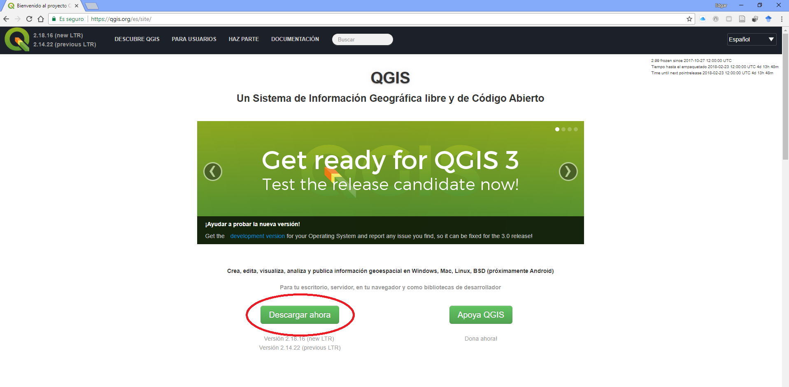

3. Seleccionar la Pestaña “Descargas de instalación”

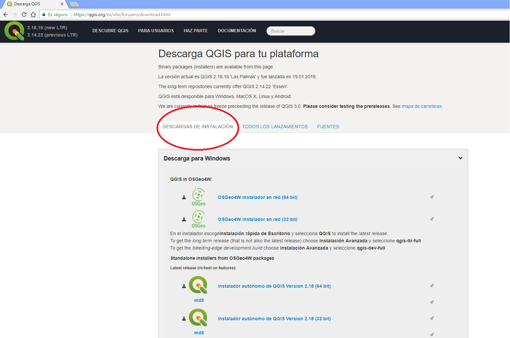

4. Escoger de acuerdo a su sistema operativo (windows, MacOS, Ubuntu/debian) y la configuración de su computadora la versión de 32 o 64 bit.
5. La descarga iniciara automaticamente en la parte baja de su navegador de internet.

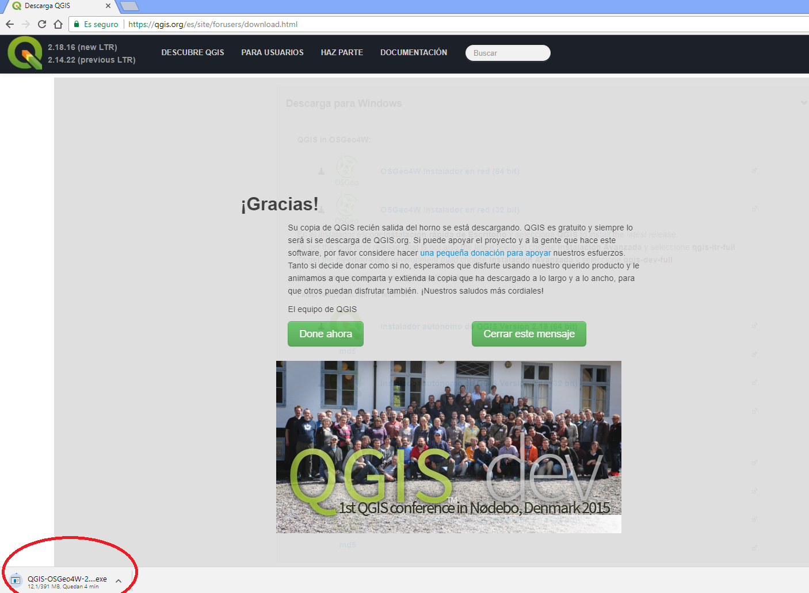

6. Al terminar la descarga, hacer click en e instalador y seleccionar "siguiente".

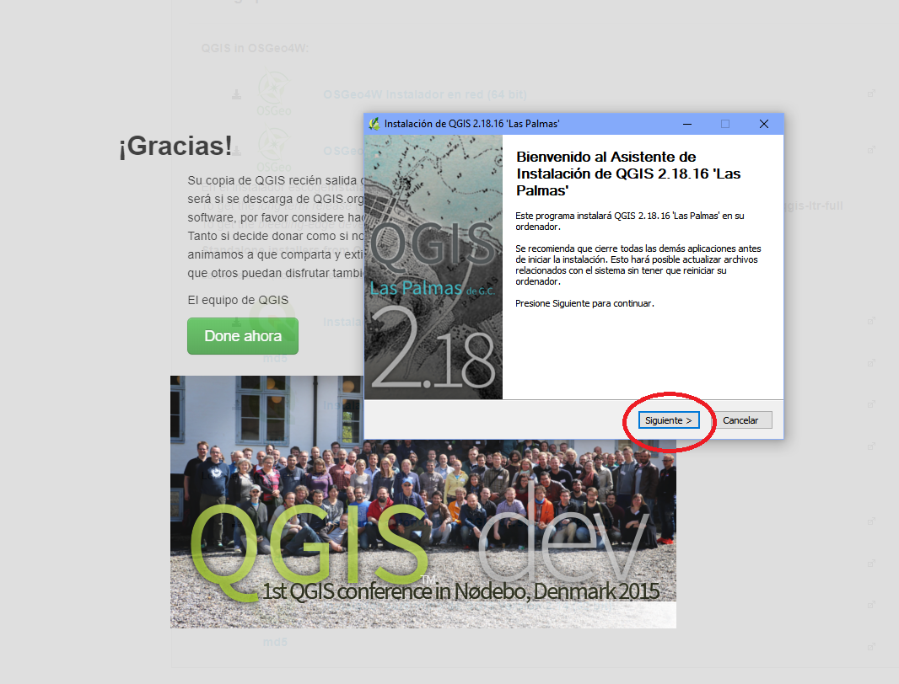

7. Acepte el acuerdo de licencia.

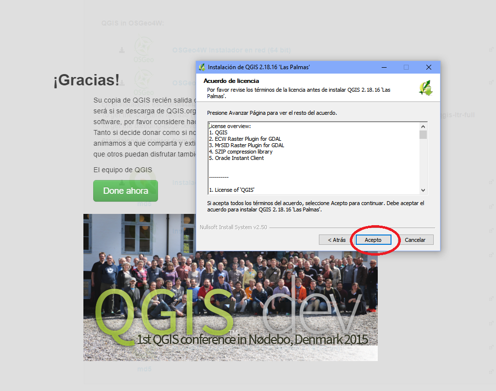

8. Elegir el lugar de destino.

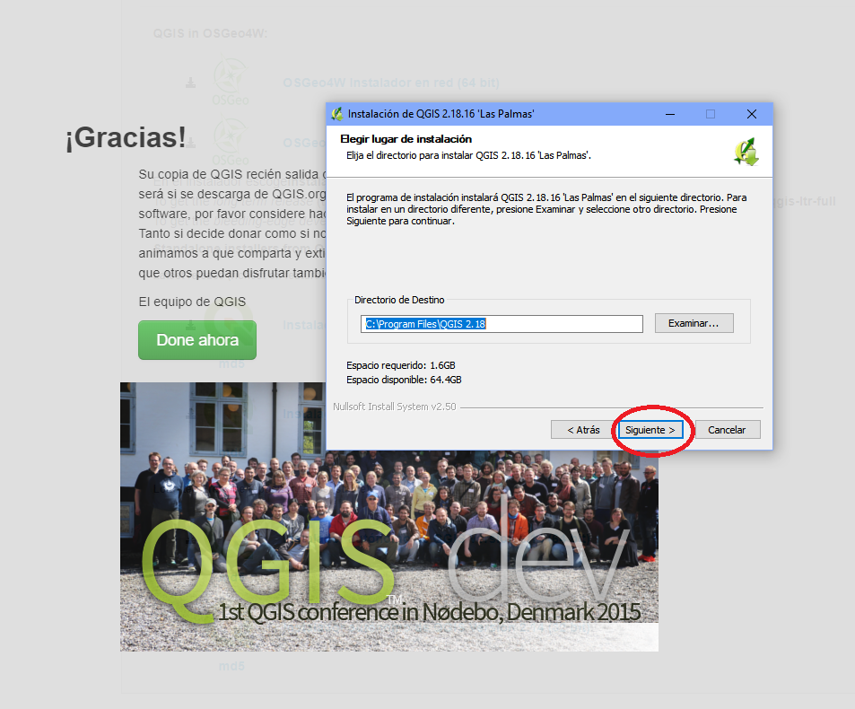

9. Dejar los valores por defecto y seleccionar "Instalar".

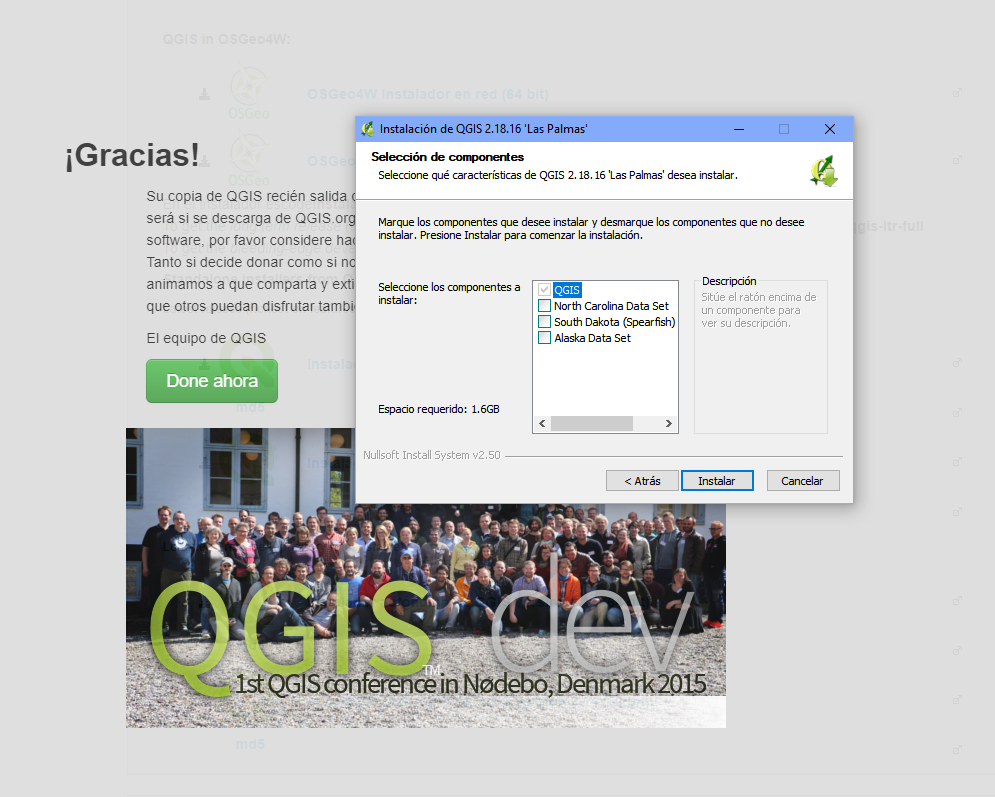

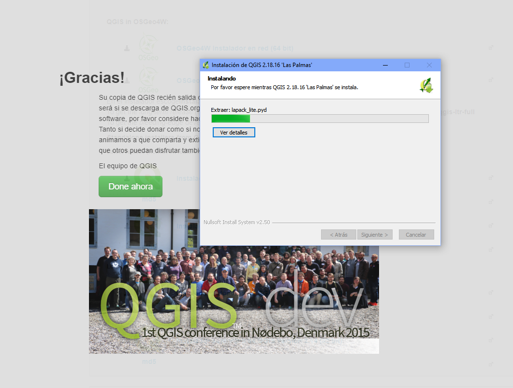

10. Al terminar la instalacion, hacer click en "Terminar".

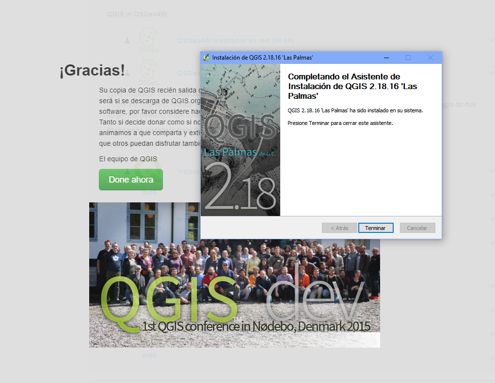

11. Se habra creado una carpeta en su escritorio llamada "QGIS 2.18", abrir la carpeta.

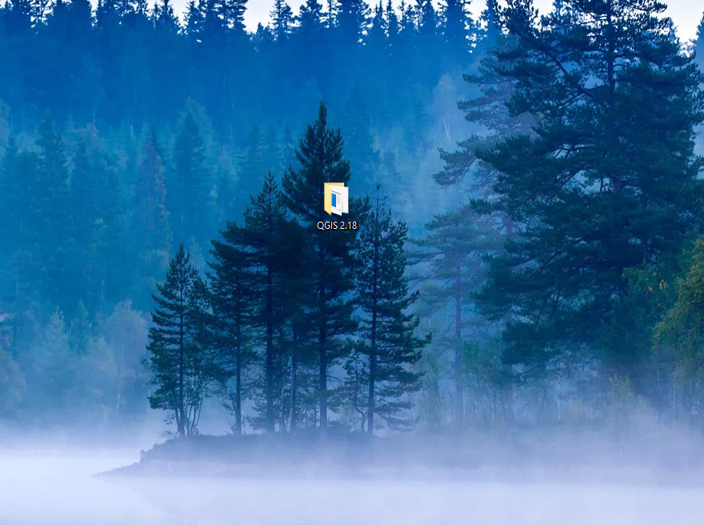

12. Abrir la aplicacion "QGIS Desktop 2.18.x".

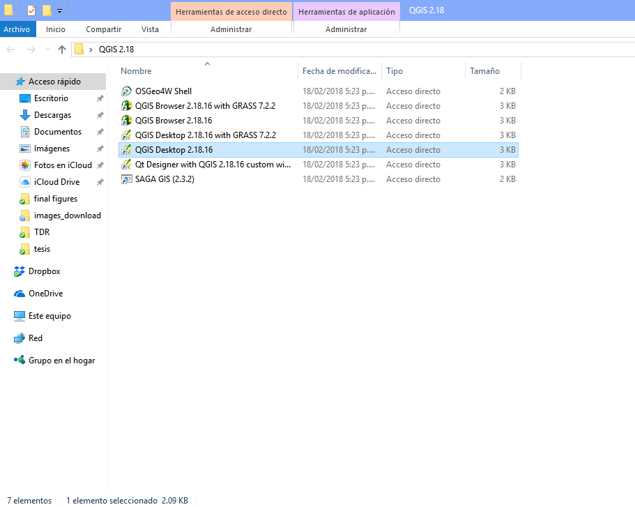

13. QGIS esta listo para ser utilizado.

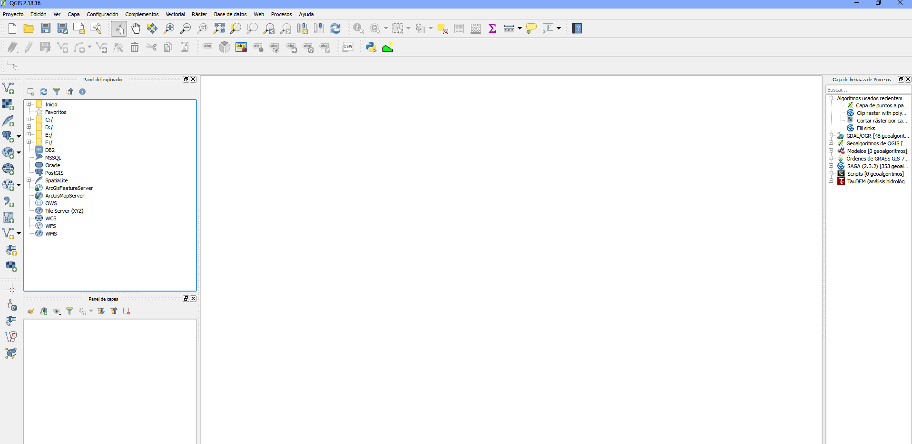

14. [ir a la guia de practica](https://EdgarJoao30.github.io/qgis_class/index.html)
